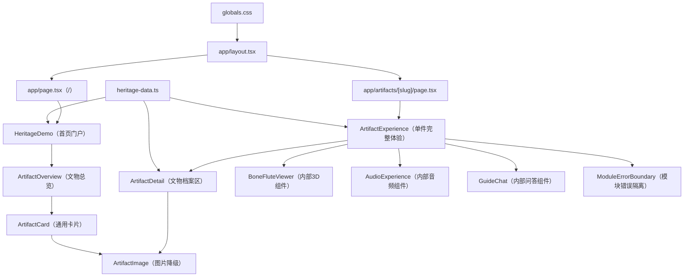
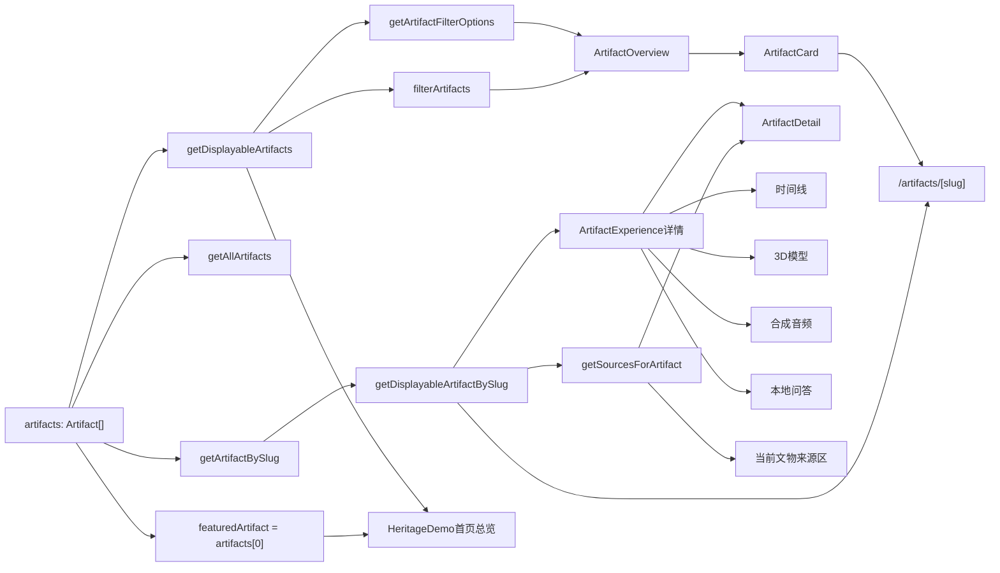
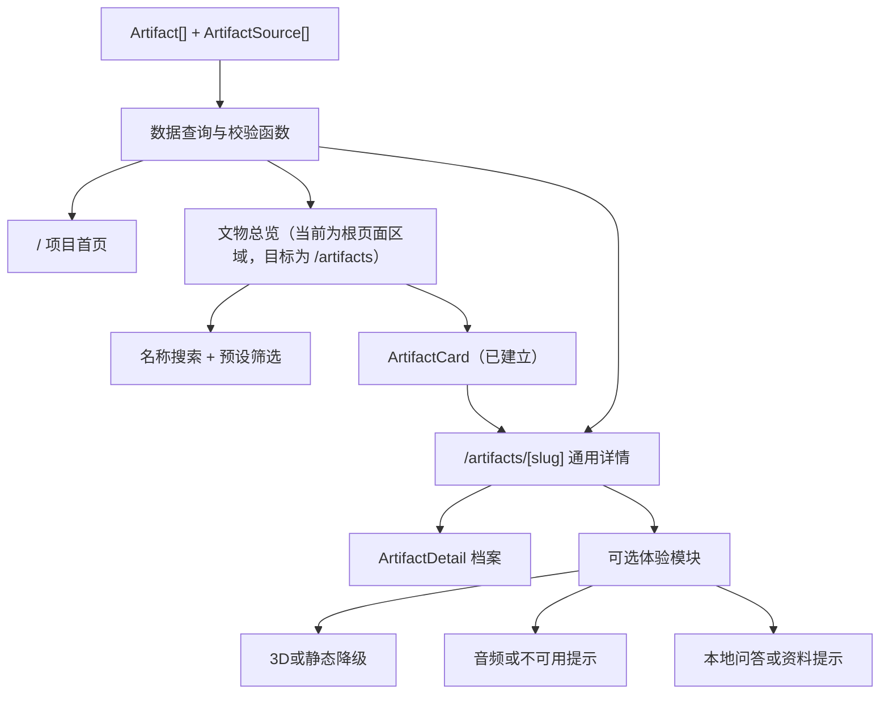

# 系统架构说明

## 1. 文档说明

本文依据 2026-07-23 的实际仓库和当前工作区编写，用于区分：

1. 当前 v0.3 多文物展示基础版已经形成的架构；
2. v0.3 自动验收完成后仍待人工确认的部分；
3. v0.3 以后才考虑的远期能力。

本文只提出方向，不在本轮移动文件、拆分组件或实现新路由。当前工作区还包含尚未提交的 Lint 基线修复，文中按实际代码描述该实现。

## 2. 当前技术栈

| 类别 | 当前实现 |
| --- | --- |
| 视图 | React 19、JSX |
| 语言 | TypeScript 5，`strict` 开启 |
| 页面结构 | Next App Router 风格的 `app` 目录 |
| 实际开发与构建 | Vinext 0.0.50、Vite 8 |
| 3D | Three.js、OrbitControls |
| 样式 | `app/globals.css` 自定义 CSS |
| 数据 | `app/heritage-data.ts` TypeScript 静态数据 |
| 服务入口 | Cloudflare Worker |
| 托管构建 | `.openai/hosting.json`、Sites Vite 插件 |
| 数据库模板 | Drizzle/D1 文件存在，但产品未启用 |
| 测试 | Node Test Runner、服务端渲染断言 |
| 包管理 | npm、`package-lock.json` |

当前不使用正式数据库、正式大模型接口、用户系统或小程序。

## 3. 当前目录结构

```text
.
├─ app/
│  ├─ layout.tsx                 # 根布局和全站元数据
│  ├─ page.tsx                   # 项目首页和文物总览入口 /
│  ├─ artifacts/
│  │  └─ [slug]/
│  │     ├─ page.tsx             # 允许展示文物的通用详情路由
│  │     ├─ not-found.tsx        # 不存在或不可展示文物的友好404
│  │     └─ error.tsx            # 详情运行时异常边界
│  ├─ HeritageDemo.tsx           # 首页门户、总览和搜索筛选
│  ├─ ArtifactExperience.tsx     # 单件完整体验，内部保留3D、音频、问答
│  ├─ ArtifactDetail.tsx         # 文物档案展示区
│  ├─ components/
│  │  ├─ ArtifactOverview.tsx     # 统一数据驱动的文物总览区域
│  │  ├─ ArtifactCard.tsx         # 可复用文物卡片
│  │  ├─ ArtifactImage.tsx        # 图片缺失和加载失败降级
│  │  └─ ModuleErrorBoundary.tsx  # 3D、音频和问答模块错误隔离
│  ├─ guide-utils.ts              # 本地问答匹配和固定安全答复
│  ├─ heritage-data.ts           # Artifact类型、文物和来源数据
│  ├─ globals.css                # 全站样式和响应式规则
│  └─ chatgpt-auth.ts            # 未被当前产品页面使用的身份辅助模板
├─ public/
│  └─ jiahu-bone-flute.jpg       # 当前文物参考图片
├─ worker/
│  ├─ index.ts                   # Worker和图片请求入口
│  └─ env.d.ts                   # Cloudflare环境类型
├─ build/
│  └─ sites-vite-plugin.ts       # 构建后打包Sites元数据和迁移
├─ db/
│  ├─ index.ts                   # 可选D1访问入口
│  └─ schema.ts                  # 当前为空
├─ drizzle/                      # 空数据库迁移元数据
├─ examples/d1/                  # 未启用的D1示例
├─ tests/
│  └─ rendered-html.test.mjs     # 构建后服务端渲染测试
├─ .openai/hosting.json          # Sites项目ID，D1/R2当前为空
├─ vite.config.ts
├─ next.config.ts
├─ tsconfig.json
├─ eslint.config.mjs
└─ package.json
```

## 4. 当前页面入口和路由

当前产品使用以下 App Router 入口：

- `app/layout.tsx`：输出 `<html lang="zh-CN">`、全局元数据和全局 CSS；
- `app/page.tsx`：根路径 `/`，渲染只包含门户和总览职责的 `HeritageDemo`；
- `app/artifacts/[slug]/page.tsx`：动态详情路由，通过允许展示的 slug 查询文物，再渲染 `ArtifactExperience`；
- `app/artifacts/[slug]/not-found.tsx`：处理不存在、占位和不可展示记录；
- `app/artifacts/[slug]/error.tsx`：处理详情渲染期间的意外错误。

当前不存在：

- `/artifacts` 文物总览；
- 文物 API 路由；
- 后台管理页面。

## 5. 当前组件关系



`BoneFluteViewer`、`AudioExperience` 和 `GuideChat` 目前都定义在 `ArtifactExperience.tsx` 内部。动态详情路由可以复用整个单件体验容器，但这三个模块本轮没有继续拆分。

## 6. 当前数据流



当前流程的关键特点：

- 数据已经从 JSX 中抽到 `heritage-data.ts`；
- 已有 `Artifact[]`；根页面只读取允许展示的列表和重点摘要，动态详情路由按 slug 读取允许展示的记录；
- `getArtifactBySlug()` 区分“数据是否存在”，`getDisplayableArtifactBySlug()` 再执行占位和展示权限过滤；
- 总览和卡片只使用 `getDisplayableArtifacts()` 的结果；
- `ArtifactOverview` 管理名称和三个筛选状态，并调用纯函数生成选项和结果；
- 名称搜索与年代或时期、材质、器物类型采用同时满足关系；
- `ArtifactDetail` 通过 props 接收文物和解析后的来源；
- 页面档案区和底部来源区都只读取当前文物的 `sources`；
- 年代、材质和器物类型已有独立字段，可供后续筛选函数使用；
- 图片、模型和声音已经使用可选结构，并记录分类、来源/授权字段及演示性质；
- 当前仍只有一件正式记录；搜索筛选已通过测试夹具验证，集中数据校验尚未实现。

## 7. 当前数据类型

当前 `Artifact` 已包含：

- `id`、`slug`、名称和可选显示信息；
- 独立的年代、材质、器物类型、地点、馆藏和尺寸字段；
- 摘要、详细说明、研究提示、时间线和本地问答；
- 可选图片数组、模型、音频数组、来源、标签和关联文物编号；
- 内容分类、审核状态、审核人、更新时间和 Demo/占位标识；
- 图片宽高、替代文本、来源、授权状态和主图标识；
- 模型分类、GLB 路径、文件状态、热点、来源、授权、备用图片和演示说明；
- 声音分类、文件路径、浏览器合成标识、热点、来源、授权和说明。

当前主要限制：

- 当前数据集只有贾湖骨笛一条记录，无法用真实第二件文物验证跨记录筛选；
- 还没有集中校验重复 `id`、重复 `slug`、无效关联文物编号和必填字段；
- 搜索、筛选选项和发布状态查询函数已经实现；
- 备用图片已经接入程序化3D初始化或渲染失败的静态降级；
- 授权字段能够记录状态，但正式资产授权凭证仍需团队提供。

## 8. 当前 3D 实现

`BoneFluteViewer` 在 `useEffect` 中直接创建 Three.js 场景：

1. 创建 Scene、PerspectiveCamera 和 WebGLRenderer；
2. 使用 Cylinder、Torus 等几何体程序生成骨笛形态；
3. 添加材质和灯光；
4. 使用 OrbitControls 支持旋转、缩放、自动旋转和复位；
5. 使用 ResizeObserver 适配容器尺寸，不支持时退回窗口 resize 监听；
6. 使用 IntersectionObserver 只在接近可视区域时运行动画，不支持时继续基础渲染；
7. 初始化和动画渲染异常时清理资源并显示备用图片与友好提示；
8. 组件失败或卸载时取消动画、断开观察器并释放场景几何体、材质、控制器和渲染器。

当前模型是程序功能演示，不是真实扫描或考古复原。

已知问题：

- 组件仍定义在 `ArtifactExperience.tsx` 内，尚未成为通用GLB查看器；
- 自动测试只能验证降级结构，真实禁用WebGL仍需人工检查；
- 只支持当前程序模型，没有通用 GLB 加载流程。

## 9. 当前音频实现

`createDemoWave()` 在浏览器中生成 WAV Blob。`AudioExperience` 在组件挂载后：

1. 获取 `<audio>` 元素 ref；
2. 创建一个 Object URL；
3. 把 URL 设置到音频元素；
4. 卸载时暂停音频、移除 `src`、调用 `load()` 并撤销 URL。

effect 只依赖音频来源类型和文件地址，普通界面重新渲染不会反复创建 URL。

当前同时捕获WAV生成、Object URL创建和媒体加载错误；失败时立即清理资源、显示“演示音频暂不可用”提示，并保持档案、3D和问答可用。意外的音频组件渲染错误由模块错误边界隔离。

当前声音是数字合成演示音效，不代表文物真实音色。尚未实现音频文件列表、波形数据、声音热点或多文物通用音频资源。

## 10. 当前本地问答实现

`GuideChat` 使用组件本地 state 保存最近消息：

- 先匹配完整标准问题；
- 再检查用户文字是否包含预设关键词；
- 无匹配时返回固定的资料不足提示；
- 匹配逻辑位于 `guide-utils.ts` 纯函数中，异常数据同样返回固定安全答复；
- 推荐问题取当前文物问题列表的前五项；
- 问答列表为空时显示“当前暂无问答资料”，不显示无效输入框；
- 意外的问答组件渲染错误由模块错误边界隔离；
- 不调用网络接口，不上传问题，不保存聊天记录。

当前问答只适合概念验证，不是正式 AI 或 RAG。

## 11. 当前构建和部署方式

### 11.1 本地命令

```text
npm run dev
npm run lint
npm run typecheck
npm run build
npm test
npm run start
```

### 11.2 构建链路

1. Vinext 通过 Vite 构建客户端、RSC、SSR 和 Worker 产物；
2. Cloudflare Vite 插件使用 `worker/index.ts` 作为服务入口；
3. `sites-vite-plugin.ts` 在构建完成后复制 `.openai/hosting.json` 和 `drizzle` 目录到产物；
4. Worker 把普通请求交给 Vinext App Router；
5. `/_vinext/image` 请求交给图片处理逻辑。

### 11.3 当前资源绑定

- `.openai/hosting.json` 已有 Sites `project_id`；
- `d1` 为 `null`；
- `r2` 为 `null`；
- `db/schema.ts` 为空；
- v0.3 不启用 D1 或 R2。

### 11.4 当前测试

`npm test` 会先构建，再使用 Node Test Runner：

- 调用构建后的 Worker 渲染根路径；
- 检查关键页面文字、审核状态和 Demo 标识；
- 检查 `Artifact`、来源、警告和本地图片文件仍存在；
- 检查总览数量、贾湖卡片、展示权限过滤和缺图降级分支。

当前12项测试已覆盖搜索和筛选纯函数、空数据、问答安全答复、图片和模块降级契约、详情展示权限、有效动态详情、未知详情404及初始服务端输出，尚未覆盖浏览器实际点击、真实WebGL/媒体失败和 375px/1440px 布局。

## 12. 当前已知架构问题

1. `ArtifactExperience.tsx` 仍同时包含3D、音频和问答内部实现，后续只能按小任务继续拆分；
2. 根路径只把 `featuredArtifact` 用于项目Hero摘要和重点文物入口，完整详情已经移至slug路由；
3. 已有根页面内的文物总览和动态详情路由，但尚无独立 `/artifacts` 总览路由；
4. 已有筛选字段和查询函数，但尚未实现集中数据校验；
5. 当前只有一条文物记录，跨文物数据关系尚未经过真实资料验证；
6. 3D、音频和问答仍内嵌在整页组件中，尚未形成可复用展示组件；
7. 模块降级已经建立，但真实WebGL、媒体失败和图片404仍需人工浏览器验收；
8. 测试仍以纯函数和服务端输出断言为主；
9. Three.js 跟随整页客户端组件进入客户端依赖；
10. `vinext start` 本地生产预览曾出现构建资产404，正式部署前需单独验证静态资源服务；
11. D1、身份辅助和示例目录属于模板能力，当前产品没有使用，容易被误认为已上线功能。

## 13. v0.3 目标架构

v0.3 继续使用单体前端和 TypeScript 静态数据，不引入微服务、数据库、消息队列或复杂权限。



### 13.1 目标原则

- 一个文物数据源；
- 一个总览页面；
- 一个通用详情路由；
- 新增文物不复制页面；
- 搜索和筛选使用纯函数；
- 可选模块缺失时正常降级；
- 当前贾湖骨笛功能优先保持；
- 未审核第二件文物不进入正式公开列表。

## 14. v0.3 路由设计方向

| 路径 | 用途 | v0.3 状态 |
| --- | --- | --- |
| `/` | 项目门户、文物总览、搜索和筛选 | 已实现 |
| `/artifacts` | 独立文物总览 | 未建立；当前总览位于 `/#artifacts` |
| `/artifacts/[slug]` | 通用文物详情 | 已实现 |
| 未知或不可展示文物路径 | 友好404、返回总览 | 已实现 |

建议使用 App Router 的动态目录：

```text
app/
├─ page.tsx
├─ artifacts/
│  └─ [slug]/
│     ├─ page.tsx
│     ├─ not-found.tsx
│     └─ error.tsx
└─ layout.tsx
```

当前 Vinext 0.0.50 已通过构建、服务端渲染测试和本地 HTTP 检查验证动态参数与 `notFound()`。详情页使用运行时查询，不依赖首页状态，也没有启用静态参数生成。

## 15. v0.3 数据类型设计方向

统一数据结构已经在 `app/heritage-data.ts` 中建立。当前实现以一个 `Artifact[]` 作为数据源，文物展示信息、筛选字段、可选数字资产、内容分类和审核状态均由同一条记录提供。图片、模型、声音、来源、时间线和问答分别使用独立子类型；缺少资料的可选模块可以省略。

设计要求：

- `id` 和 `slug` 全局唯一；
- 分类字段用于筛选，不从展示文字中临时解析；
- `timeline`、`questions`、`model` 和 `audio` 可以缺失；
- 主图片记录宽高、替代文本、署名和失败替代信息；
- 来源由当前文物记录持有，详情和页脚只读取当前文物来源；
- 审核状态缺失时不能默认已审核；
- 不在类型中塞入尚未确定的知识图谱或数据库字段。

建议的数据函数：

```text
getAllArtifacts()
getDisplayableArtifacts()
getArtifactBySlug(slug)
getDisplayableArtifactBySlug(slug)
getSourcesForArtifact(artifact)
getArtifactFilterOptions(artifacts)
filterArtifacts(artifacts, query)
validateArtifacts(artifacts, sources)
```

其中读取全部文物、读取允许展示文物、按 slug 查找、按 slug 查找允许展示文物、来源读取、筛选选项和组合筛选均已实现并有自动测试；集中校验函数仍是后续任务。这些函数应继续保持无副作用，便于测试。

## 16. 建议的组件拆分顺序

拆分必须按小任务进行，不一次重写 `HeritageDemo.tsx`。

### 第一步：数据查询和校验（部分完成）

- 已增加读取全部文物、按 slug 查找及可选字段安全读取函数；
- 下一小任务再增加筛选选项和集中数据校验函数；
- 不改页面表现；
- 先补纯函数测试。

### 第二步：文物卡片（已完成）

- 已创建 `ArtifactCard`；
- 卡片只读取统一数据；
- 已处理图片缺失、可选字段和中文审核状态显示。

### 第三步：文物总览（根页面版本已完成）

- 已在根页面创建总览区域和空状态；
- 已增加名称搜索、三类筛选、结果数量、无结果和重置；
- 独立 `/artifacts` 路由留到路由阶段验证后再决定。

### 第四步：通用详情路由（已完成）

- 已创建 `/artifacts/[slug]`；
- 通过 `ArtifactExperience` 复用 `ArtifactDetail` 和现有体验模块；
- 已增加不存在、格式异常、占位和不可展示 slug 的友好404；
- 已增加详情运行时错误边界；
- 本轮没有拆分3D、音频或问答内部组件。

### 第五步：迁移现有体验模块（v0.3已完成）

- 3D、音频和问答已经作为可选区块接入贾湖详情；
- 图片、3D、音频和问答已经增加模块级降级；
- 本轮保留三个模块在 `ArtifactExperience.tsx` 内，不提前实施通用GLB或声音实验室。

### 第六步：首页调整（v0.3已完成）

- 根页面保留项目门户内容；
- 已增加总览入口和重点文物入口；
- 首页不再重复渲染完整详情。

## 17. 异常降级设计

### 17.1 页面级

- 未知 slug：友好错误页和返回总览链接；
- 数据集合为空：总览显示空状态；
- 必填字段无效：记录不进入正式列表，并在开发检查中报错。

### 17.2 模块级

- 图片失败：固定比例占位区；
- 3D 失败：静态参考图和提示；
- 音频失败：保留声音性质说明并显示不可用；
- 问答缺失：显示暂无问答资料；
- 来源缺失：显示待补充，不隐藏审核状态；
- 单项异常不得传播成整页白屏。

### 17.3 内容级

- 资料未审核：显示待审核；
- 来源无法解析：显示缺失来源编号或待补充；
- 演示素材：继续显示演示性质；
- 不使用 AI 自动补全缺失事实。

## 18. 测试策略

### 18.1 数据测试

- `id`、`slug` 唯一；
- 来源编号有效；
- 必填筛选字段存在；
- 未审核记录不会被错误标为已审核；
- 测试夹具不会进入正式导出数据。

### 18.2 纯函数测试

- 名称搜索；
- 年代、材质、器物类型单项和组合筛选；
- 重置和无结果；
- 按 slug 查找；
- 筛选选项去重。

### 18.3 页面渲染测试

- 首页、总览、有效详情和未知详情；
- 当前贾湖内容和演示警告仍存在；
- 当前文物只显示自己的来源；
- 缺少可选模块时仍能渲染。

### 18.4 自动质量门槛

```text
npm run lint
npm run typecheck
npm run build
npm test
```

### 18.5 人工验收

- 375px 和 1440px；
- 搜索、筛选、返回导航；
- 3D 操作及失败降级；
- 音频播放、暂停和重复进入；
- 本地问答；
- 图片加载和异常路径；
- 浏览器控制台错误。

## 19. 后续扩展原则

v0.3 完成后，后续功能仍按 `ROADMAP.md` 分阶段推进：

- 授权 GLB 和模型热点；
- 声音实验室；
- 资料驱动的 AI 讲解；
- 三种讲解模式；
- 数字纪念卡；
- AIGC 科普视频；
- 小程序 `web-view`；
- 正式部署和全设备交付。

扩展时继续遵守：

- 先有审核资料，再有正式页面内容；
- 先复用通用组件，再新增专用功能；
- 单项失败可降级；
- 不为远期功能提前引入数据库、微服务和复杂权限；
- 每次只完成一个可以独立测试和回退的小任务。

## 20. v0.3 明确不采用的架构

- 微服务；
- 独立后端业务系统；
- 正式数据库；
- 消息队列；
- 复杂缓存集群；
- 复杂角色权限；
- 自训练大模型；
- 知识图谱；
- 原生 App；
- AR/VR 运行时。

这些能力当前没有必要，也不应成为 v0.3 的前置条件。
