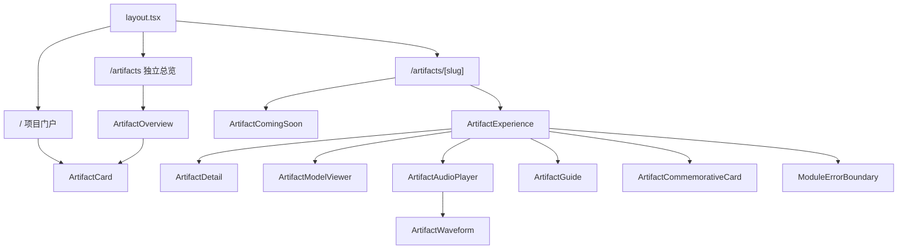
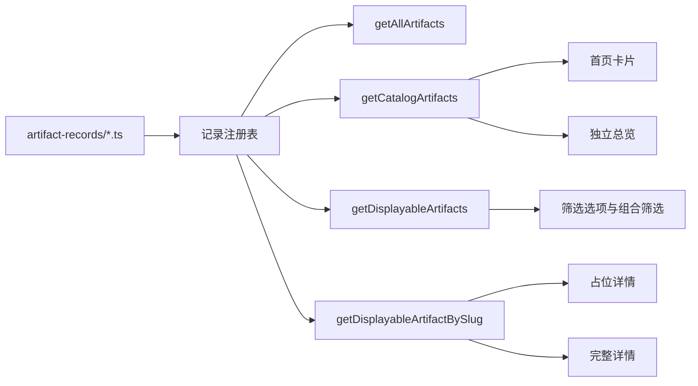

# 系统架构说明

## 1. 文档说明

本文依据 2026-08-17 的实际仓库和 v0.5 收口版本编写，用于说明当前已经运行的页面、数据、交互、降级、测试和接入架构。

当前项目仍采用单体前端与 TypeScript 静态数据，不引入正式数据库、微服务、用户系统或联网大模型。所有演示模型、合成声音和占位内容都必须显式标注，不得替代考古资料审核。

## 2. 技术栈

| 类别 | 当前实现 |
| --- | --- |
| 视图 | React 19、Next App Router 风格组件 |
| 语言 | TypeScript 5，`strict` 开启 |
| 开发与构建 | Vinext 0.0.50、Vite 8 |
| 3D | Three.js、GLTFLoader、OrbitControls |
| 音频 | 原生 Audio、Web Audio 解码、Canvas 波形 |
| 样式 | `app/globals.css` 自定义 CSS |
| 数据 | 每件文物独立 TypeScript 记录 + 统一注册表 |
| 服务入口 | Cloudflare Worker |
| 数据库模板 | Drizzle/D1 文件存在，但产品未启用 |
| 测试 | Node Test Runner、构建后 Worker 渲染、纯函数与源码契约测试 |
| 包管理 | npm、`package-lock.json` |

## 3. 当前目录结构

```text
.
├─ app/
│  ├─ layout.tsx                      # 根布局、元数据和全局 CSS
│  ├─ page.tsx                        # 项目首页 /
│  ├─ artifacts/
│  │  ├─ page.tsx                     # 独立文物总览 /artifacts
│  │  └─ [slug]/
│  │     ├─ page.tsx                  # 通用详情或占位详情
│  │     ├─ not-found.tsx             # 不存在或不可展示记录
│  │     └─ error.tsx                 # 详情运行时异常边界
│  ├─ artifact-records/
│  │  ├─ index.ts                     # 记录注册表
│  │  ├─ jiahu-bone-flute.ts          # 贾湖骨笛演示记录
│  │  ├─ artifact-002.ts              # 公开占位记录
│  │  └─ artifact-003.ts              # 公开占位记录
│  ├─ components/
│  │  ├─ ArtifactOverview.tsx         # 搜索、筛选和卡片总览
│  │  ├─ ArtifactCard.tsx             # 通用文物卡片
│  │  ├─ ArtifactComingSoon.tsx       # 占位详情首屏
│  │  ├─ ArtifactModelViewer.tsx      # 程序模型/GLB查看器
│  │  ├─ ArtifactAudioPlayer.tsx      # 通用音频播放器
│  │  ├─ ArtifactWaveform.tsx         # 解码与交互波形
│  │  ├─ ArtifactGuide.tsx            # 本地问答界面
│  │  ├─ ArtifactCommemorativeCard.tsx# 数字纪念卡
│  │  ├─ ArtifactImage.tsx            # 图片降级
│  │  └─ ModuleErrorBoundary.tsx      # 模块错误隔离
│  ├─ ArtifactExperience.tsx          # 单件完整体验编排
│  ├─ ArtifactDetail.tsx              # 文物档案区
│  ├─ heritage-data.ts                # 类型、查询、筛选和目录规则
│  ├─ audio-waveform.ts               # WAV、包络、细柱与定位纯函数
│  ├─ hotspot-audio-link.ts           # 热点与音轨联动纯函数
│  ├─ memorial-card-text.ts           # 纪念卡文本布局纯函数
│  └─ globals.css                     # 全站与响应式样式
├─ scripts/
│  ├─ artifact-new.mjs                # 文物草稿生成
│  ├─ artifact-check.mjs              # 文物资料预检
│  └─ start-production.mjs            # 本地生产预览
├─ tests/
│  ├─ artifact-toolkit.test.mjs       # 接入工具与校验规则
│  └─ rendered-html.test.mjs          # 页面、模块和纯函数测试
├─ public/
├─ worker/
├─ build/
├─ db/                                # 未启用数据库模板
├─ .github/workflows/quality.yml
└─ package.json
```

## 4. 页面入口和路由

| 路径 | 用途 | 当前状态 |
| --- | --- | --- |
| `/` | 项目门户、重点文物与“查看全部文物”入口 | 已实现 |
| `/artifacts` | 独立文物总览、搜索和组合筛选 | 已实现 |
| `/artifacts/[slug]` | 通用文物详情或公开占位详情 | 已实现 |
| 未知/非法/不可展示 slug | 友好 404 和返回总览 | 已实现 |

占位记录可以出现在目录并进入“资料整理中”页面，但不会渲染专业档案、来源、3D、音频或问答，并输出 `noindex, nofollow`。

## 5. 组件关系



3D、音频、波形、问答和纪念卡已经从整页组件中拆分。`ArtifactExperience` 负责读取当前文物的可选模块并编排状态，不直接实现底层渲染。

## 6. 数据注册、查询与发布边界



关键规则：

- 每件文物使用独立数据文件，主记录和子记录 ID 应保持稳定。
- `catalogVisibility` 决定目录可见性，审核状态与占位标识决定完整详情权限。
- 占位记录不因出现在目录而被当作专业内容。
- 内容审核与素材审核分离；正式公开文件必须有来源、授权和审核记录。
- 缺失专业资料时保留空缺或中性占位，不通过代码推断事实。

## 7. 文物接入工具

### `artifact:new`

- 生成独立记录文件并注册；
- 默认创建 `draft + internal` 草稿；
- 拒绝非法 slug、重复 ID/slug/displayIndex 和已有目标文件；
- 不生成专业事实或正式素材。

### `artifact:check`

- 检查记录是否注册及目录规则是否一致；
- 检查来源 ID、字段定位、关联文物、模型热点和音频引用；
- 检查审核日期、内容审核、素材审核与授权状态；
- 检查公开图片、GLB 和音频文件是否存在；
- 以中文按文物输出错误和警告。

## 8. 3D 架构

`ArtifactModelViewer` 采用懒加载客户端组件：

1. 根据记录选择程序化演示模型或 `GLTFLoader` 加载授权 GLB；
2. 自动计算模型中心、相机距离和记录配置的比例/朝向；
3. 使用 OrbitControls 支持旋转、缩放、自动旋转和复位；
4. 使用 ResizeObserver 适配容器，IntersectionObserver 控制离屏渲染；
5. 释放动画帧、观察器、几何体、材质、控制器和渲染器；
6. 初始化、加载或运行异常时切换到备用图片和文字提示。

通用热点框架会把模型局部坐标投影到屏幕，支持说明面板和关联音轨。当前贾湖程序模型未显示热点编号，以避免标记遮挡笛孔；该能力仍供未来有审核数据的 GLB 使用。

## 9. 音频与波形架构

`ArtifactAudioPlayer` 负责音轨选择、资源生命周期、原生播放控件和失败提示：

- 浏览器合成演示通过 `createDemoWave()` 生成 WAV Blob；
- 文件音频直接使用记录中的公开路径；
- 切换或卸载时暂停并撤销旧 Object URL；
- 热点联动只对存在且匹配的 `audioId` 执行播放；
- 自动播放被阻止或播放失败时显示局部提示。

`ArtifactWaveform` 负责可视化和定位：

1. 获取或生成音频字节；
2. 使用 Web Audio 解码声道；
3. 计算并按音轨来源缓存 96 桶 min/max 包络；
4. 在 Canvas 中绘制居中细柱并区分已播放/未播放颜色；
5. 支持 Canvas 点击、拖动和原生 range 键盘/触屏定位；
6. 解码失败时保留原生播放器和装饰性降级音柱。

## 10. 本地问答架构

`ArtifactGuide` 只读取当前文物已经录入的问题和答案：

- 优先匹配完整标准问题，再匹配预设关键词；
- 无匹配或数据异常时返回固定资料不足提示；
- 不调用网络接口、不上传问题、不保存聊天记录；
- 问答为空或组件异常时显示局部降级。

该模块不是正式 AI 或 RAG；接入联网能力前必须先建立经审校、可引用的资料库。

## 11. 数字纪念卡架构

`ArtifactCommemorativeCard` 在浏览器本地使用 Canvas 生成 3:4 PNG：

- 使用当前文物名称、项目品牌和已登记主图；
- 文本测量、换行、缩放、截断和文件名逻辑位于 `memorial-card-text.ts`；
- 可选昵称仅存在组件内存中，不上传、不持久化；
- 不把年代、材质、用途等专业字段自动写入纪念卡；
- 弹窗包含焦点循环、Escape 关闭、关闭后恢复焦点和错误提示；
- 图片、Canvas 或下载失败不会影响详情其他模块。

## 12. 降级与安全边界

### 页面级

- 未知或不可展示 slug：友好 404；
- 占位记录：专用整理中页面；
- 详情运行时异常：友好错误页和返回总览入口。

### 模块级

- 图片失败：固定比例替代内容；
- 3D 失败：备用图片和文字；
- 波形失败：装饰音柱，原生音频继续可用；
- 音频失败：保留声音分类和说明；
- 问答缺失：资料待补充；
- 纪念卡失败：局部状态提示；
- 任一模块异常均由错误边界隔离，不传播为整页白屏。

### 内容级

- 程序模型标注为数字演示模型；
- 合成声音标注为数字合成演示音效；
- 未审核资料不标记为正式内容；
- 页面只展示文物资料来源，不展示底层技术或产品参考栏；
- 不使用 AI 自动补全缺失事实。

## 13. 构建、测试与 CI

### 本地命令

```text
npm run dev
npm run lint
npm run typecheck
npm run artifact:check
npm run build
npm run test:unit
npm run verify
```

`npm run verify` 依次执行：

1. ESLint；
2. TypeScript；
3. 文物资料预检；
4. Vinext 生产构建；
5. Node Test Runner 全部测试。

当前 46 项测试覆盖：

- 文物脚手架、注册与资料规则；
- 首页、独立总览、有效详情、占位详情、404 和生产资源；
- 搜索、组合筛选、目录可见性和可选字段；
- 波形包络、细柱几何、缓存、定位和失败；
- 热点音频联动、播放提示与 Object URL 生命周期；
- 纪念卡文本布局、焦点循环、Data URL 和安全字段边界；
- 关键模块源码契约和降级结构。

`.github/workflows/quality.yml` 在 Node.js 22 上执行 `npm ci` 和 `npm run verify`。

## 14. 构建与部署

1. Vinext 通过 Vite 构建客户端、RSC、SSR 和 Worker 产物；
2. Worker 把应用请求交给 Vinext App Router；
3. Vite 配置将 Three.js 拆分为核心、渲染器、着色器和 WebGL 相关块；
4. Sites 插件复制托管元数据和迁移目录；
5. `.openai/hosting.json` 中 D1/R2 当前为空，产品不依赖数据库绑定。

当前仓库具备构建和本地生产预览能力，但正式 Sites 项目、域名、备案和目标设备发布仍需团队确认。

## 15. 已知限制

- 文物 002、003 仍是占位数据，尚无第二件正式文物验证真实跨记录内容差异。
- 当前问答是本地规则匹配，不是正式知识库。
- 通用热点框架已有实现，但需要经过审核的真实模型坐标和音频资料才能正式启用。
- 微信 WebView 和馆内目标设备尚未完成真实设备兼容性验收。
- Vinext 对部分动态路由的构建时分类仍会给出提示，但构建和运行不受影响。
- D1、身份辅助和示例目录属于模板能力，当前产品未使用。

## 16. 后续扩展原则

- 先有审核资料，再有正式页面内容；
- 新文物复用统一注册、总览、详情和模块，不复制页面；
- 单项失败必须局部降级；
- 演示资源不得表述为真实扫描、真实音色或正式复原；
- 不为远期功能提前引入数据库、微服务和复杂权限；
- 每次只交付一个可独立测试和回退的小任务。
